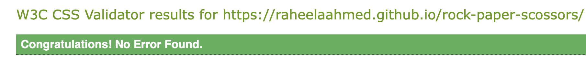

# Welcome to [Rock-Paper-Scissors!](https://raheelaahmed.github.io/rock-paper-scossors/)

Rock-Paper-Scissors is a classic hand game enjoyed by people of all ages. I have created this game for computers and mobiles. It's a single-player game where you compete against the computer. I've provided buttons for you to choose your move (rock, paper, or scissors), and the computer picks its move randomly.

## Rock Paper Scissors:
* Engaging Background: The website sets the tone with a captivating rock background image that fills the page body.
* Gradient-Infused Heading: A captivating heading graces the top of the page, featuring a background with a smooth gradient color transition.
* Centralized Elements: All interactive components, including the game area, reload button, and "How To Play" button, are conveniently positioned in the center of the page for easy access. This user-friendly layout ensures a streamlined experience on any device.
* Matching Aesthetics: The game area seamlessly complements the heading with a background that echoes the gradient color scheme, creating a cohesive visual experience.

### Heading:

At the top of the page, there is a logo or heading.

### Game Area:

#### Score:

In this game area, there are "Player Score:" and "Computer Score:". Scores will be displayed in front of them once they earn a score, and the scores will keep increasing with every round they win.

#### Moves Left:

Below the scores, there are "Total 10 Moves," which will decrease with every round. When the number of moves left reaches 0, the game ends.

#### Button:

There are three buttons: "Rock, Paper, and Scissors." The player will choose a button of their choice to play the game. The buttons will turn yellow with a CSS hover effect when the mouse goes over them, and will also work on mobile devices with a tap on  the button.

#### Computer Choice:

The computer randomly picks "Rock, Paper, or Scissors" and displays its choice.

#### Round Result:

The result is displayed at the end of every round. It can be a computer win, a player win, or a tie.

#### Reload:
 
At the bottom of the page, there's a reload button. Clicking it will restart the game.

#### How To Play:
There is a "How To Play" button at the bottom of the page. Clicking the button displays a popup box that explains the game rules and instructions. Double-clicking the popup makes it disappear. This functionality works on touchscreens as well.

## Game Over and Winner:

The game has a limited number of moves. When there are no moves left (moves left reach 0), the game ends, and the final result is displayed.

## Responsive Design:

The website has a responsive design, meaning it adjusts to different screen sizes.

## Main Technologies:
I built this website using HTML for the structure, CSS for styling, and JavaScript for interactivity.

## Credits:
I used W3Schools to choose background colors and a YouTube video for guidance with JavaScript (https://www.youtube.com/watch?v=-jeHs213y-A). I also used AI to help fix the code for double-clicking on touchscreens.

## Fonts and Icons:
 Google font are used for styling the website.

## Deployment:

I used GitHub for creating my repository and Codespaces for developing my website. I deployed my project through GitHub by following these steps:

####

1. Click Settings.
1. From the left sidebar menu, open Pages.
1. Select the "main" branch as the root branch.
1. eploy your work.
1. The website link will appear in a few seconds.

Live Website link :https://raheelaahmed.github.io/rock-paper-scossors/

## Cloning:

 You can clone this project using this URL: "https://github.com/raheelaahmed/rock-paper-scossors.git".

## TESTING: 

### Manual Testing:

| Tests     | working   |    
| :---      |    :----: |       
| player's Score Display   | yes      | 
|Computer's Score Display  | yes       | 
| Score increment   |yes.       |
|Result Display|  yes|
|Computer's choice display|yes|
|Moves reduction| yes|
|Mouse hoover color|yes|
|Button Tap for hover color on touch screen|yes|
|Reload button|yes|
|Game Over display|yes|
|Game winner display|yes|
|how to play button|yes|

I used Lighthouse in the DevTools to check accessibility. Here are the results:

| Tests     | Passed    | Failed    |
| :---      |    :----: |       ---:|
|Jshint   | yes      | no   |
|official W3C validator  | yes       | no      |
| official (Jigsaw) validator   |yes.       |no.       |

### JS Validation:

### HTML Validation:

### Css validation:

## Bugs andFixes:

I was having problem with responsiveness of my web design and i solved my problem using "html Media Quries".
I was having trouble setting the background image for the body. It wasn't working in my CSS file, but using the style attribute in HTML is working now.
I was having trouble with double clicks registering on mobile screens. I fixed this by using the touchstart function in JavaScript.

## Browser Testing:
I tested my website on several browsers, including Chrome and Safari, and it's working fine.

## Raheela Aftab
